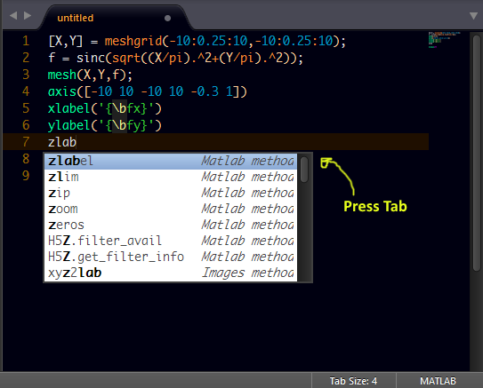

# MatLab Completions

## About

All Completion Suggestions for Matlab on Sublime text.

## How to Use

Start typing on a Matlab file and press tab to select completion suggestion.

### Screenshot
#### Import Completions



## Installation

### By Package Control

1. Download & Install **`Sublime Text 3`** (https://www.sublimetext.com/3)
1. Go to the menu **`Tools -> Install Package Control`**, then,
   wait few seconds until the installation finishes up
1. Now,
   Go to the menu **`Preferences -> Package Control`**
1. Type **`Add Channel`** on the opened quick panel and press <kbd>Enter</kbd>
1. Then,
   input the following address and press <kbd>Enter</kbd>
   ```
   https://raw.githubusercontent.com/evandrocoan/StudioChannel/master/channel.json
   ```
1. Go to the menu **`Tools -> Command Palette...
   (Ctrl+Shift+P)`**
1. Type **`Preferences:
   Package Control Settings – User`** on the opened quick panel and press <kbd>Enter</kbd>
1. Then,
   find the following setting on your **`Package Control.sublime-settings`** file:
   ```js
       "channels":
       [
           "https://packagecontrol.io/channel_v3.json",
           "https://raw.githubusercontent.com/evandrocoan/StudioChannel/master/channel.json",
       ],
   ```
1. And,
   change it to the following, i.e.,
   put the **`https://raw.githubusercontent...`** line as first:
   ```js
       "channels":
       [
           "https://raw.githubusercontent.com/evandrocoan/StudioChannel/master/channel.json",
           "https://packagecontrol.io/channel_v3.json",
       ],
   ```
   * The **`https://raw.githubusercontent...`** line must to be added before the **`https://packagecontrol.io...`** one, otherwise,
     you will not install this forked version of the package,
     but the original available on the Package Control default channel **`https://packagecontrol.io...`**
1. Now,
   go to the menu **`Preferences -> Package Control`**
1. Type **`Install Package`** on the opened quick panel and press <kbd>Enter</kbd>
1. Then,
search for **`MatlabCompletions`** and press <kbd>Enter</kbd>

See also:

1. [ITE - Integrated Toolset Environment](https://github.com/evandrocoan/ITE)
1. [Package control docs](https://packagecontrol.io/docs/usage) for details.


### Download Manually

* Download the files using the GitHub .zip download option
* Unzip the files
* Copy the folder to your Sublime Text 2 `Packages` directory


optionally

###For windows
#### for Sublime text 2
copy the **Matlab-Completions** folder and paste the file into the location of your default packages. It should be found by opening sublime text then clicking `preferences -> Packages`


#### For Sublime text 3
copy the **Matlab-Completions** folder and paste the file into the following location.

##### File location

> **Note:** You will need to *show hidden files* first

> C:\Users\User name\AppData\Local\Sublime Text 3\Cache

## Contributing

All contributions are welcome.

## License
© 2015 Taiwo Kareem | taiwo.kareem36@gmail.com.

Read **License.txt**

## Acknowledgements
I'd first like to say a very big thank you to God my creator. Without him, this wouldn't be possible.


